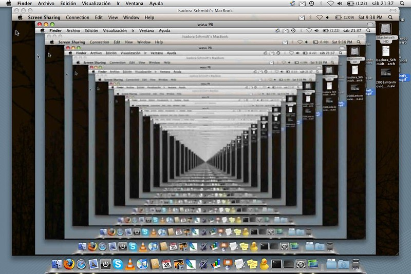

# C - Recursion :space_invader:

<p align="center">
 

## Description :face_in_clouds:

This poject is about how to use the recursion, and waht is.

## Tests :heavy_check_mark:

* [tests](./tests): Folder of test files. Provided by Holberton School.

## Helper File :raised_hands:

* [_putchar.c](./_putchar.c): C function that writes a character to `stdout`.

## Header File :file_folder:

* [main.h](./main.h): Header file containing prototypes for all
functions written in the project.

| File                      | Prototype                             |
| ------------------------- | ------------------------------------- |
| `0-puts_recursion.c`      | `void _puts_recursion(char *s);`      |
| `1-print_rev_recursion.c` | `void _print_rev_recursion(char *s);` |
| `2-strlen_recursion.c`    | `int _strlen_recursion(char *s);`     |
| `3-factorial.c`           | `int factorial(int n);`               |
| `4-pow_recursion.c`       | `int _pow_recursion(int x, int y);`   |
| `5-sqrt_recursion.c`      | `int _sqrt_recursion(int n);`         |
| `6-is_prime_number.c`     | `int is_prime_number(int n);`         

## Formatting and Examples :nerd_face:
<details open>
<summary> <strong> Compile's flags </strong> </summary>

```
-Wall -Werror -Wextra -pedantic -std=gnu89
```

</details>
<details open>
<summary> <strong> Example </strong> </summary>

```
julien@ubuntu:~/Recursion$ cat 3-main.c
#include "main.h"
#include <stdio.h>

/**
 * main - check the code
 *
 * Return: Always 0.
 */
int main(void)
{
    int r;

    r = factorial(1);
    printf("%d\n", r);
    r = factorial(5);
    printf("%d\n", r);
    r = factorial(10);
    printf("%d\n", r);
    r = factorial(-1024);
    printf("%d\n", r);
    return (0);
}
julien@ubuntu:~/Recursion$ gcc -Wall -pedantic -Werror -Wextra -std=gnu89 3-main.c 3-factorial.c -o 3-factorial
julien@ubuntu:~/Recursion$ ./3-factorial 
1
120
3628800
-1
julien@ubuntu:~/Recursion$
```

</details>

## Tasks :page_with_curl:

<p align="center">
 

* **0. She locked away a secret, deep inside herself, something she once knew to be true... but chose to forget** :speech_balloon:
  * [0-puts_recursion.c](./0-puts_recursion.c): C function that prints a string,
  followed by a new line.

* **1. Why is it so important to dream? Because, in my dreams we are together** :speech_balloon:
  * [1-print_rev_recursion.c](./1-print_rev_recursion.c): C function that prints
  a string in reverse.

* **2. Dreams feel real while we're in them. It's only when we wake up that we realize something was actually strange** :speech_balloon:
  * [2-strlen_recursion.c](./2-strlen_recursion.c): C function that returns the
  length of a string.

* **3. You mustn't be afraid to dream a little bigger, darling** :speech_balloon:
  * [3-factorial.c](./3-factorial.c): C function that returns the factorial of
  a given number.

* **4. Once an idea has taken hold of the brain it's almost impossible to eradicate** :speech_balloon:
  * [4-pow_recursion.c](./4-pow_recursion.c): C function that returns the value of
  a number `x` raised to the value of an input `y`.
    * If `y` is less than `0`, the function returns `-1`.

* **5. Your subconscious is looking for the dreamer** :speech_balloon:
  * [5-sqrt_recursion.c](./5-sqrt_recursion.c): C function that returns the natural square
  root of a number.
    * If the number does not have a natural square root, the function returns `-1`.

* **6. Inception. Is it possible?** :speech_balloon:
  * [6-is_prime_number.c](./6-is_prime_number.c): C function that checks in an
  integer is a prime number.
    * If the integer is prime, the function returns `1`.
    * Otherwise, the function returns `0`.
